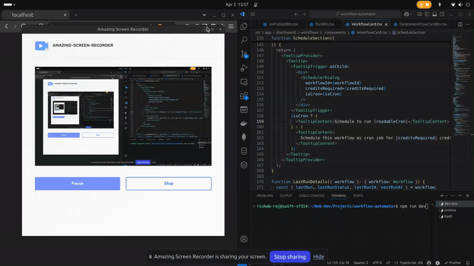

# 🚀 Ultimate Web Scraping Automation Tool 📊

 Empower your digital strategy! This tool enables you to monitor competitors’ websites, track pricing changes in real-time, gather market insights, and automate data collection workflows—all without manual effort.

---

## ✨ Key Features

* **Automated Monitoring:** Keep tabs on competitor sites and pricing effortlessly.
* **Real-Time Data:** Get up-to-the-minute information for timely decisions.
* **Market Insights:** Gather crucial data to understand market trends.
* **No-Code Workflow Builder:** Visually design complex scraping logic with drag-and-drop.
* **AI-Enhanced Extraction:** Leverage AI for smarter and more resilient data retrieval.
* **Secure & Scalable:** Built with robust authentication, secure credential management, and reliable data storage.

---

## 🛠️ Technology Stack

* **Frontend:** Next.js (Dynamic UI, Server-Side Rendering)
* **Authentication:** Clerk (Robust user management & security)
* **State Management:** Tanstack ReactQuery (Advanced client-side data fetching & caching)
* **Workflow Canvas:** Reactflow (Intuitive drag-and-drop interface)
* **Database:** MySQL
* **ORM:** Prisma (Efficient and type-safe database access)
* **AI Integration:** Gemini (Enhanced data extraction capabilities)

---

## 🖼️ Demo / Screenshots

---

## 🚀 Getting Started

### Onboarding & Dashboard

1.  **Simple Signup:** Get started quickly using your Google account via Clerk.
2.  **Free Trial Credits:** Receive **250 complimentary credits** upon signup to explore the platform's capabilities.
3.  **Insightful Dashboard:**
    * Monitor your remaining credit balance.
    * View statistics about your created workflows.
    * Track execution logs and results in real-time.

---

## ⚙️ Core Functionality

### Dynamic Workflow Builder

* **Effortless Creation:** Simply provide a title and description to initiate a new workflow.

### Powerful Visual Editor

Build sophisticated automation logic with ease using the drag-and-drop canvas:

* **User Interactions:** Automate actions like filling inputs, clicking buttons, navigating between pages, and scrolling.
* **Data Extraction:**
    * Select and retrieve specific HTML elements.
    * Extract text content from elements.
    * Utilize integrated **Gemini AI** for advanced, context-aware data extraction.
* **Data Storage:** Define and manage JSON properties to structure your scraped data seamlessly.
* **Control & Delivery:**
    * Implement delays and timing controls within your workflow.
    * Send execution results and extracted data to specified endpoints via **Webhooks**.

### Execution & Automation

* **Real-Time Monitoring:** Observe detailed logs and phase-wise execution results as your workflows run.
* **Publish & Schedule:** Once your workflow is perfected, publish it and set up automated execution schedules using **cron jobs**.

---

## 🔒 Security & Billing

* **Secure Credential Management:** Integrations and sensitive data are handled with end-to-end encryption.
* **Flexible Billing:**
    * Choose from various credit packages based on your usage needs.
    * Purchase additional credits easily.
    * *(Upcoming: Integrated payment gateway for seamless transactions).*

---

## 🗺️ What’s Next? (Roadmap)

We're constantly working to enhance the tool. Here's what's planned:

* **💳 Payment Gateway Integration:** Implementing Stripe/LemonSqueezy (or similar) for smooth in-app credit purchases.
* **🛡️ Advanced Scraping Enhancements:** Developing techniques to bypass captchas and common anti-scraping measures more effectively.
* **🤖 Autonomous AI Agent:** Building an intelligent agent capable of autonomously creating and managing scraping tasks based on high-level goals.